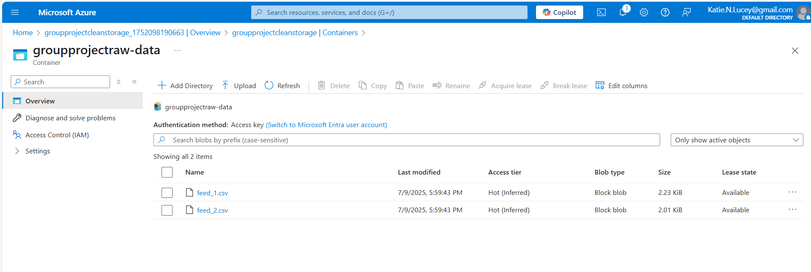
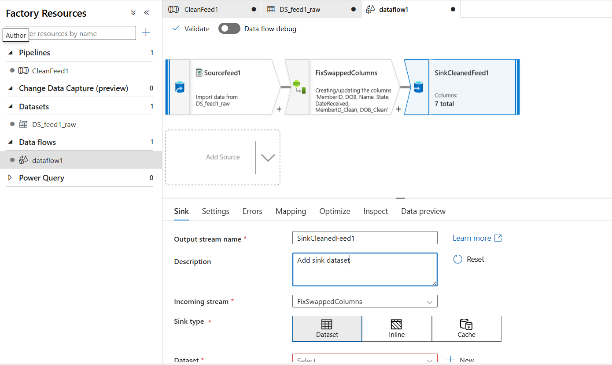
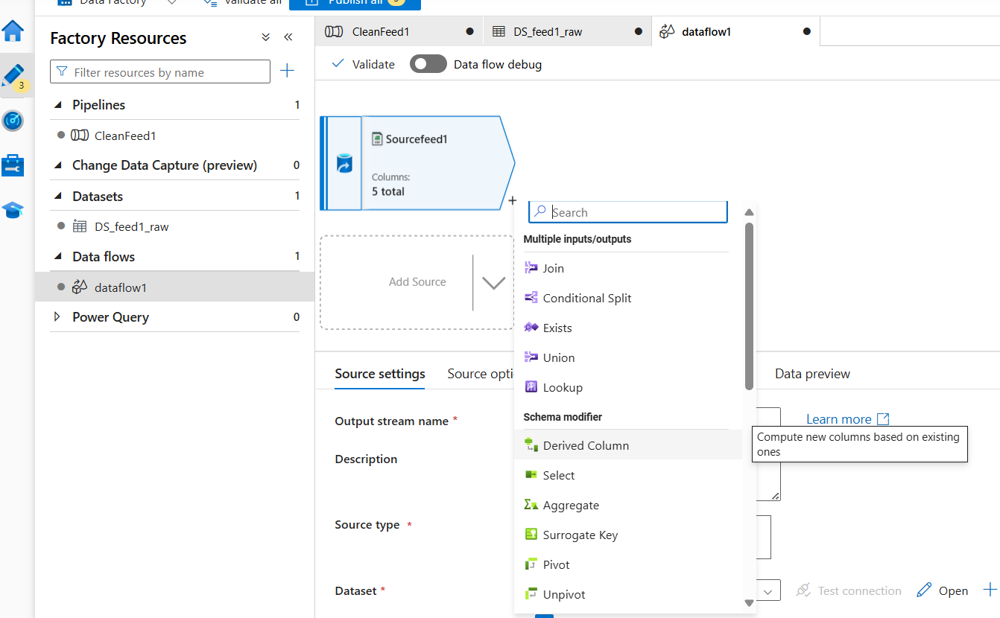
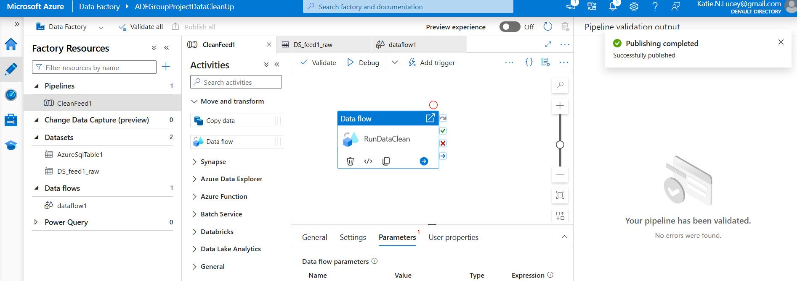
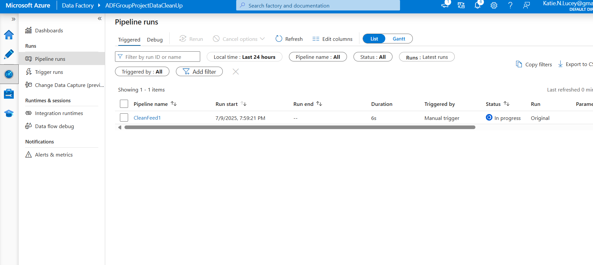
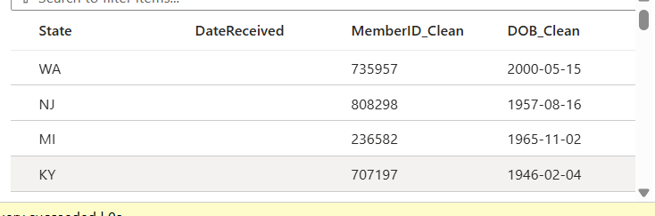
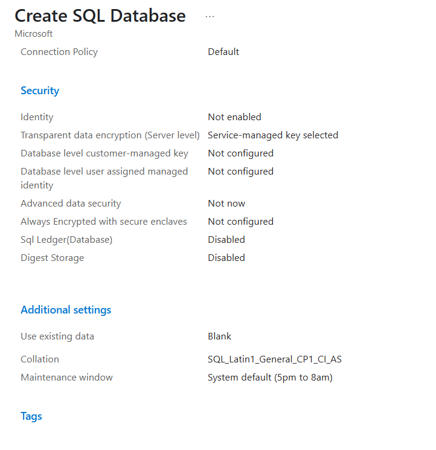
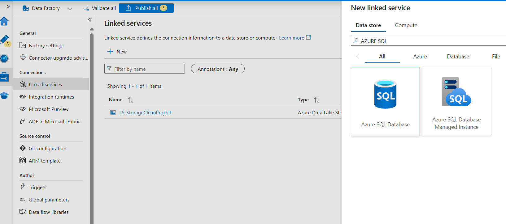
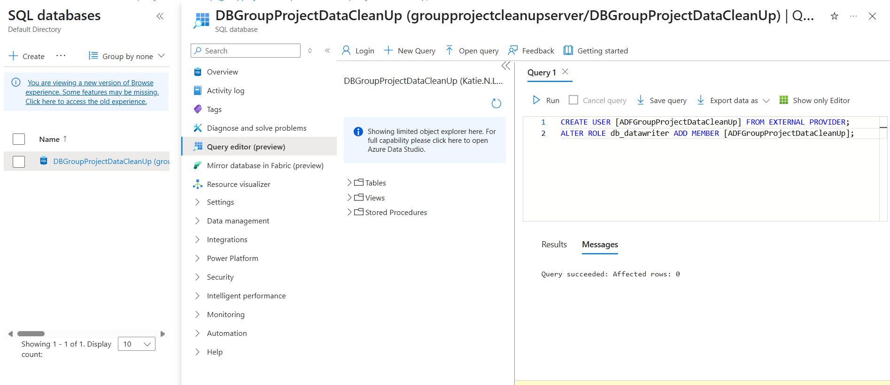

# Machine-Washed: Azure Data Cleaning Pipeline

An automated cloud-based data cleaning pipeline built with Azure Data Factory and Azure Blob Storage to transform inconsistent raw data into standardized, analysis-ready datasets.

## Project Overview

Inconsistent data formats can create delays, increase manual effort, and reduce confidence in downstream analysis. This project demonstrates how Microsoft Azure can automate a repeatable data-cleaning workflow.

Using Azure Data Factory, we built a pipeline that ingests raw CSV files from Azure Blob Storage, applies transformation logic through Mapping Data Flows, and produces standardized output with minimal manual intervention. Key transformations included correcting improperly formatted Member IDs and converting numeric date-of-birth values into valid date formats.

The project also included configuration of Azure SQL Database connectivity and permissions, demonstrating how Azure Data Factory can be integrated with a relational database environment.

## Technologies Used

- Microsoft Azure
- Azure Data Factory
- Azure Blob Storage
- Azure SQL Database
- Mapping Data Flows
- SQL
- CSV data

## Pipeline Workflow

The solution follows a cloud-based ETL workflow:

**Raw CSV Data → Azure Blob Storage → Azure Data Factory → Mapping Data Flow → Cleaned & Standardized Output**

### 1. Raw Data Storage

Raw CSV source files were uploaded to Azure Blob Storage to provide a centralized cloud location for pipeline input.

### 2. Data Transformation

Azure Data Factory Mapping Data Flows were used to define the cleaning and transformation process.

The pipeline addressed data-quality issues including:

- `MemberID` values that had been incorrectly interpreted as dates
- `DOB` values stored numerically in `yyyymmdd` format
- Data-type inconsistencies that could interfere with downstream processing

### 3. Derived Column Logic

Derived Column transformations were used to create standardized values from the improperly formatted source fields.

For `MemberID`, the incorrectly formatted value was reformatted and converted into a numeric representation. For `DOB`, the numeric source value was converted into a valid date type for downstream use.

### 4. Pipeline Validation and Execution

After the transformation logic was configured, the pipeline was tested using Azure Data Factory's debugging and validation capabilities. Once validated, the pipeline was published and triggered.

Pipeline execution could then be reviewed through Azure Data Factory monitoring.

### 5. Cleaned Output

The completed transformation produced standardized output containing cleaned fields such as `MemberID_Clean` and `DOB_Clean`.

## Azure SQL Integration

In addition to the Blob Storage-based cleaning workflow, the project included Azure SQL Database configuration and integration work.

An Azure SQL Database environment was created and configured for use with the Azure data environment.

Azure Data Factory connectivity to Azure SQL Database was configured through a linked service.

Database permissions were also configured so the Azure Data Factory identity could interact with the SQL environment. This included creating the ADF user through the external identity provider and granting `db_datawriter` access.

## Results

The completed solution demonstrated how a repeatable Azure pipeline can reduce manual data-cleaning effort and improve consistency across incoming datasets.

Once configured, new source files following the expected structure could be placed in the raw-data location and processed through the pipeline to generate standardized output. This approach reduces repetitive manual corrections and the risk of human error while creating a more reliable foundation for downstream analytics.

## Limitations & Future Improvements

The current pipeline assumes that incoming files follow a consistent schema. Changes to column names, formats, or file structures could require modifications to the existing transformation logic.

Potential future enhancements include:

- Supporting multiple incoming file schemas
- Adding more dynamic validation and error-handling rules
- Automating pipeline triggers when new files arrive
- Expanding database integration for downstream storage and analytics
- Adding monitoring and alerting for failed or anomalous pipeline runs

## Repository Contents

- `feed_1.csv` and `feed_2.csv` — sample source data
- `01_Data_Transformation_Flow.png` through `09_ADF_SQL_Database_Permissions.png` — implementation screenshots
- `Final Project Paper-Machine Washed.pdf` — full project documentation

## Key Skills Demonstrated

**Data Engineering:** ETL pipeline development, data transformation, schema standardization, cloud data workflows

**Azure:** Azure Data Factory, Azure Blob Storage, Azure SQL Database, linked services, Mapping Data Flows

**Data Quality:** Data-type correction, field standardization, repeatable transformation logic

**Pipeline Operations:** Validation, publishing, execution, and monitoring

## Project Context

This project was completed as part of graduate coursework in Business Analytics and was developed collaboratively by:

- Grace Akinyi
- Michele Gipson
- Briana Harper
- Katie Lucey
